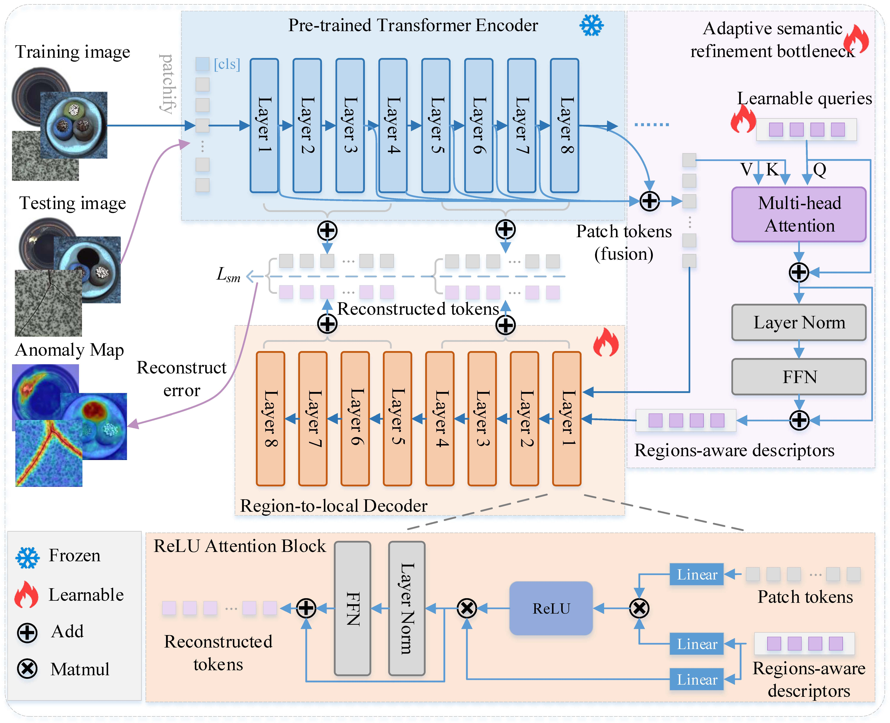

# ASRB-AD: Reverse Distillation with Adaptive Semantic Bottleneck and Region-Aware Recovery for Unified Anomaly Detection



## Abstract
Knowledge distillation has shown great potential in unsupervised anomaly detection, and reverse distillation further improves detection performance through an asymmetric teacher-student network architecture. However, in scenarios involving unified anomaly detection across multiple object categories, current reverse distillation methods face two major challenges. First, the student network tends to over-generalize to accommodate multi-class reconstruction, while cross-category semantic confusion further weakensthe decoder's discriminative ability, often leading to excessively high reconstruction quality in anomalous regions. Second, the bottleneck module struggles to maintain multi-category semantic integrity while achieving sufficiently compact feature embeddings, leading to the infiltration and propagation of anomalous information into the student network, thus creating a vicious cycle with the over-generalization problem. To address these challenges, this paper proposes a reverse distillation framework based on adaptive semantic refinement bottleneck and region-aware feature recovery. Specifically, we first design an adaptive semantic refinement bottleneck that integrates learnable queries into Transformer to extract region-aware descriptors, enabling the extraction of normal feature prototypes across multiple categories and effectively filtering out anomalous features. Subsequently, it develops a region-aware feature recovery module, which achieves fine-grained restoration of local details from region-level semantic features through an improved region-to-local decoder. Extensive experiments on four benchmark datasets demonstrate that the proposed method achieves competitive performance in multi-class settings, on par with specialized single-class approaches, thereby validating the effectiveness and generalizability of the framework. 

## Environment

This project shares the same environment dependencies as DINOv2. Key dependencies include:

- Python 3.9+
- PyTorch 1.11.0+
- torchvision 0.12.0+
- CUDA 11.3+ (for GPU acceleration)

For detailed environment setup, please refer to the [official DINOv2 environment documentation](https://github.com/facebookresearch/dinov2).

## Data Preparation

### VisA Dataset

Before running the script, make sure the raw VisA dataset is placed in the correct directory (e.g., `data/visa/`). Then run:

```bash
python generate_dataset_json/visa.py
```
This will generate the JSON files required for training and evaluation.

### BTAD Dataset
Make sure the raw dataset is placed in the correct directory, then run:

```bash
python generate_dataset_json/btad.py
```

### Other Datasets
For other datasets, simply ensure they are downloaded and placed in the corresponding directories (e.g., data/MVTec/, data/RealIAD/, etc.). 


## Examples
Multi-Class Setting

```
python Unified_Model_Multi_Class.py --dataset MVTec-AD --data_path ./data/mvtec
```

Single-Class Setting

```
python Single_Class.py --dataset MVTec-AD --data_path ./data/mvtec
```


## Acknowledgements

This project builds upon the excellent work of the following open-source repositories:

- [DINOv2](https://github.com/facebookresearch/dinov2)
- [Dinomaly](https://github.com/guojiajeremy/Dinomaly)
